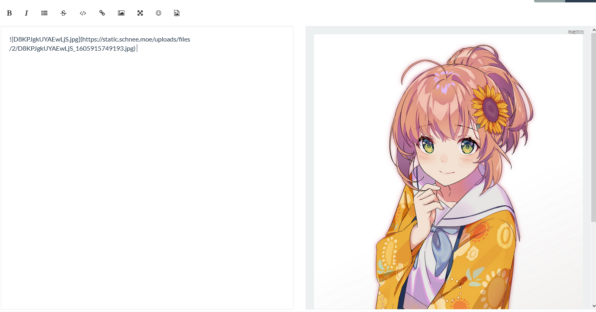
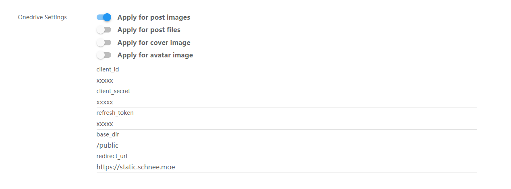

# NodeBB Plugin onedrive

A plugin that uploads images and files to onedrive,  refer from nodebb-plugin-imgur and onedrive-api.

## Installation

    npm install nodebb-plugin-onedrive

## Preview

When upload a picture or file, it can upload to the onedrive automatics and convert the url in the markdown.



## Setup

You can set up upload which kind of pictures to onedrive


### Auth

You need to set up the config of `client_id`, `client_secret`, `refresh_token`.  

Please refer to the [microsoft graph-oauth](https://docs.microsoft.com/en-us/onedrive/developer/rest-api/getting-started/graph-oauth?view=odsp-graph-online), and [heymind obtain refresh_token](https://heymind.github.io/tools/microsoft-graph-api-auth).

### Get the public url of the upload picture

Use such as [FODI](https://github.com/vcheckzen/FODI) to index the content of the onedrive. `base_dir` is the share dir in your onedrive.

Then you can use nginx to reverse proxy to that server. And then set the `redirect_url` to that.  

Here's a example of using [FODI](https://github.com/vcheckzen/FODI), when `redirect_url=xxx.yyy.zzz` and share the `/public` path.

```c
server {
    listen 80;
    gzip on;
    server_name xxx.yyy.zzz;
    charset utf-8;

    location / {
        rewrite ^(.*) "https://yourserver?file=$request_uri";
    }
}
```